# pawsitive_training
An online shop and lesson hub for pet training. 

Source code can be found [here](https://github.com/pac-dan/pawsitive_training)

The live project can be viewed [here](https://pawsitive-training-37efa34a3204.herokuapp.com/)

## Purpose of Project 
The aim of the project is to help pet owners train their pets while providing a one-stop shop for pet training products. The website combines an online store—with carefully selected pet care products—and a subscription service that grants access to exclusive training video lessons.


---

## Links to content

[**Purpose of Project**](#purpose-of-project)

[**ECommerce Business Model**](#ecommerce-business-model)

[**Web Marketing**](#web-marketing)

[**Features**](#Features)

[**User Experience**](#User-Experience)
- [Design](#design)
    - [Fonts](#fonts)
    - [Colour](#colour)
    - [Wireframes](#wireframes)

[**Development Process**](#Development-Process)
- [Project Planning](#project-planning-and-documentation-in-github)
- [Search Engine Optimization](#search-engine-optimization)
- [Data Model](#data-model)

[**Testing**](#Testing)
- [Manual Testing](#manual-testing)
    - [Feature Testing](#feature-testing)
    - [Responsiveness](#responsiveness)
    - [Lighthouse](#lighthouse)
    - [Code Validation](#code-validation)
        - [Python](#python-code)
        - [JavaScript](#javascript-code)
        - [HTML](#html-validation)
        - [CSS](#css-validation)
    - [User Stories](#user-stories)
- [Automated Testing](#automated-testing)
    - [Django testing](#testing-django-views-models-and-forms)

[**Bugs**](#Bugs)

[**Libraries and Programs Used**](#libraries-and-programs-used)

[**Deployment**](#Deployment)
- [Deploying the app on Heroku](#deploying-the-app-on-heroku)
- [Making a local clone](#making-a-local-clone)
- [Running the app in your local environment](#running-the-app-in-your-local-environment)

[**Credits**](#Credits)

[**Acknowledgements**](#acknowledgements)

---

## ECommerce Business Model
This project follows a B2C model aimed at selling pet training products directly to consumers.
The site offers both tangible products—such as training aids, accessories, and nutritional supplements—and a digital service in the form of subscription-based video lessons.
The online store is designed to streamline the purchase process by minimizing friction and allowing users to quickly add items to their basket and check out.

## Web Marketing

---

## Features
The following pages are visible to all users, logged in or not.

<details>
<summary>Welcome Page (Landing Page)</summary>

- The landing page offers two primary actions:
    - Shop for pet training products
    - Subscribe to pet training lessons
- The page, like all others, features a header with the following elements (from left to right):
    - A clickable site icon that returns users to the homepage.
    - A search bar and button allowing users to search products by keyword.
    - A display showing the logged-in user's name (empty if the user is anonymous).
    - A staff dropdown menu (visible only to staff) with options to:
        - View the Product Management
    - An account dropdown menu for users not logged in, offering:
        - Register
        - Login
    - A basket link that takes the user directly to the View Basket page.
- The page footer, common to all pages, features a call-to-action encouraging users to "Stay in Touch!", a link to the site's [Facebook promotional page](https://www.facebook.com/profile.php?id=61574171532774), and an invitation to subscribe to the mailing list (integrated with MailChimp).

.png)

</details>

<details>
<summary>Product Display Page</summary>

- This page displays pet training products in a tiled layout, which can be filtered by one of the category filters at the top or by a keyword search from the navbar.
- If there are any current special offers, they are showcased in a rotating banner (using a Bootstrap Carousel).
- Each product tile is clickable and links to its respective Product Detail Page.

.png)

</details>

<details>
<summary>Product Detail Page</summary>

.png)

- This page provides detailed information about a product:
    - A clear image of the product.
    - The full name and description of the product.
    - Pricing details, the product category, and current stock levels.
    - A range-bound quantity input.
    - A primary "Add To Basket" button, which adds the specified quantity to the user's basket.
    - Additional buttons below the main content that link to:
        - Return to the shop
        - Edit the product (visible only to staff)
        - View the basket

</details>

<details>
<summary>Basket Page</summary>

- The Basket page lists all items added to the basket.
- Users can adjust the quantity of each product or remove fully(using a range-bound input).
- The page includes buttons to return to the All Products page.
- A summary table displays the subtotal, and the grand total.
- A checkout button directs the user to the Checkout Page.

.png)

</details>

<details>
<summary>Checkout Page</summary>

.png)

- The Checkout page is divided into three main sections:
    - A Stripe Payment element for secure payment entry and delivery details.

    - Pay Now Button

</details>

<details>
<summary>Checkout Success Page</summary>

.png)

- The Checkout Success page displays a "Payment Successful" message.
- It summarizes the order and delivery details.
- A call-to-action invites users to browse the shop section of the site.

</details>

<details>
<summary>Video Lessons Page</summary>

.png)

- The main section lists the available training video lessons, the lessons dropdown in navlinks contains categories for lesson difficulty.
- Chosen lessons in each course are available for free, while additional lessons require a subscription (indicated by a padlock icon on non-accessible lessons).

</details>

<details>
<summary>Video Player Page</summary>

.png)

- The Video Player page is centered around the video element that plays the training lesson.
- Thumbnails for the remaining lessons are displayed for quick navigation.

</details>

<details>
<summary>Register Page</summary>

.png)

- The Register page allows new users to sign up with email, username, and password (with confirmation).
- All fields are required, and the form is styled consistently with the rest of the site.

</details>


---
## Future Features

- It would be useful for staff to track the volume of sales for different pet training products over various timeframes. A dashboard, potentially built using Plotly, could display sales by product and period, providing valuable insights for inventory and marketing decisions.
- An added benefit for subscribers would be the ability to share videos of their pet training progress, with features to like and comment on each other's posts. This community engagement tool would require moderation to ensure that feedback remains constructive and supportive.
- Another future feature under consideration is an embedded video-calling functionality. This would allow subscribers to connect with one another or even with professional pet trainers for live training sessions, tips, and advice. Unfortunately, due to time constraints, this feature was not implemented in the current version of the project.


---
[Return to top](#pawsitive_training)
# User Experience

## Design

### Fonts 

The Roboto font is used throughout the project. Its a sleek simple style.

---


### Colour
The following colour palette was used in the project:

- **Deep Teal:** Conveys trust and reliability, used predominantly for headers and call-to-action elements.
- **Vibrant Orange:** Highlights special offers and key promotional elements, adding energy and drawing attention.
- **Soft Grey:** Provides a neutral backdrop for content areas, ensuring a clean and modern look.
- **Crisp White:** Used for contrast, helping text and images stand out.

These primary colours are derived from the project's hero image, which features a friendly pet in a dynamic training environment. The vibrant orange emphasizes special promotions, while deep teal and soft grey create an inviting, professional atmosphere throughout the site.

---


### Wireframes
#### _Product Display page_

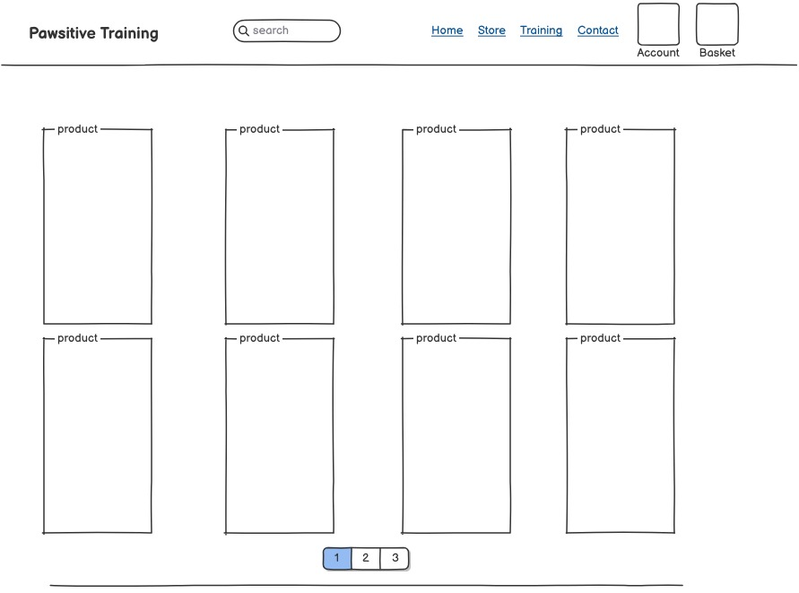

#### _Product Detail page_
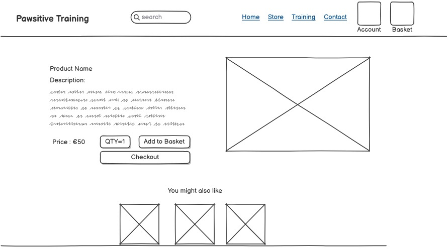

#### _Basket page_
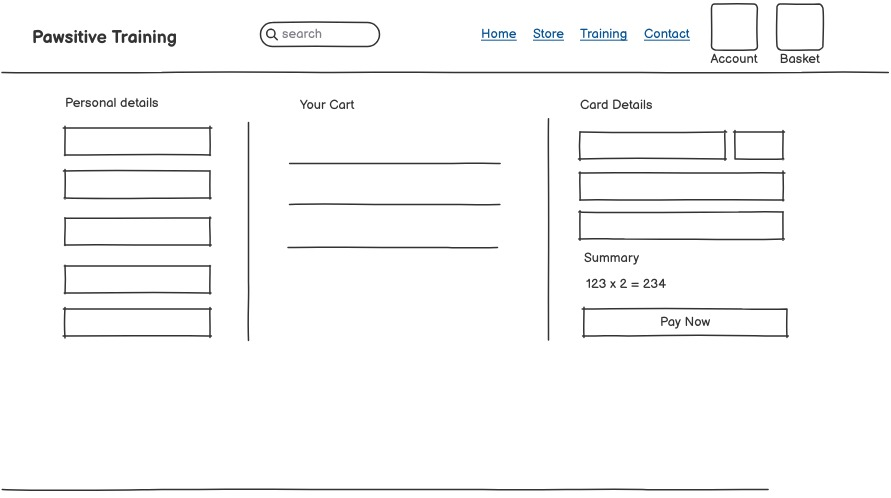

#### _Checkout page_


#### _Lessons page_
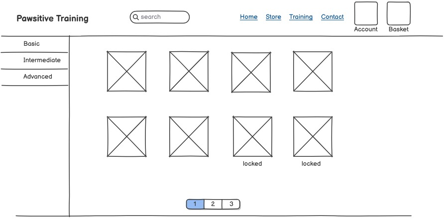

[Return to top](#pawsitive_training)

# Development Process

## Project Planning and Documentation in GitHub

For this project, GitHub Issues were used to document the development tasks and track progress through clearly defined user stories and epics. We created two issue templates—one for User Epics and one for User Stories—to ensure that all requirements were captured and prioritized. Various labels were employed to quickly identify issue types, including Bugs, User Epics, User Stories, and Style. We also used MoSCoW prioritisation with labels such as must-have, should-have, and could-have to focus on the most critical features first.

To break the project into manageable sprints, GitHub Projects was used to create a Kanban board where issues were moved from 'Todo' to 'In Progress' to 'Done' as they were completed. Below are the primary epics and their associated user stories:

### Epic 1: Dog Training Video Content
- **Story 1:** As a dog owner, I want to view a library of free training videos so I can quickly learn tips.
- **Story 2:** As a registered user, I want access to full-length training classes so I can learn in-depth techniques.
- **Story 3:** As a user, I want to bookmark my favorite videos so I can easily revisit them.

### Epic 2: Online Store
- **Story 1:** As a dog owner, I want to browse a store featuring treats, training gear, and accessories so I can purchase quality products.
- **Story 2:** As a shopper, I want to filter products by category (e.g., treats, toys, training aids) to quickly find what I need.
- **Story 3:** As a shopper, I want to view detailed product pages with images and descriptions so I can make informed purchasing decisions.
- **Story 4:** As a shopper, I want to add items to my basket and review them before checkout.
- **Story 5:** As a shopper, I want to securely complete purchases using an integrated Stripe payment system so my transactions are safe.
- **Story 6:** As a shopper, I want the option to save my shipping details for future orders to streamline repeat purchases.

### Epic 3: User Account & Authentication
- **Story 1:** As a visitor, I want to register for an account so I can access premium features.
- **Story 2:** As a registered user, I want to log in and manage my profile so my personal data and preferences are maintained.
- **Story 3:** As a user, I want to view my order history and class registrations for easy reference.

### Epic 4: User Experience & Navigation
- **Story 1:** As a user, I want a responsive website design so I can easily navigate on any device.
- **Story 2:** As a user, I want a clear navigation menu linking to training videos, classes, the store, and my account so I can quickly find what I need.
- **Story 3:** As a user, I want a search function to quickly locate videos and products that match my interests.
- **Story 4:** As a user, I want clear feedback on my actions (e.g., adding items to the basket) so I know that the system has responded.

### Epic 5: Marketing & SEO
- **Story 1:** As the site owner, I want to implement SEO best practices (meta tags, sitemap, robots.txt) so my site is easily discoverable.
- **Story 2:** As the site owner, I want to integrate a newsletter signup and social media links so I can engage my audience and boost brand presence.

### Epic 6: Admin & Content Management
- **Story 1:** As an admin, I want a backend interface to add or edit training videos, classes, and products so content is updated easily.
- **Story 2:** As an admin, I want to view a dashboard of orders and class registrations so I can monitor business performance.
- **Story 3:** As an admin, I want to receive alerts for low stock levels so I can replenish store inventory promptly.

This structured planning using GitHub Issues and Projects allowed us to clearly define the scope and priority of features, ensuring an organized development process from initial design through to final deployment.

## Search Engine Optimization
A set of long- and short-tail keywords was developed to target pet owners and training enthusiasts. The initial set was generated through brainstorming and by examining related searches on Google. This list was then refined to a smaller, more targeted set of keywords, which were each trialed on [wordtracker.com](https://wordtracker.com). The final list of terms, ordered by estimated search volume, is shown below:

| Term                      | Short/Long-tail | Volume  | Competition |
|---------------------------|-----------------|---------|-------------|
| Pet Training              | Short           | 180000  | 50.12       |
| Dog Training              | Short           | 90000   | 42.78       |
| Cat Training              | Short           | 30000   | 35.00       |
| Online pet training       | Long            | 22000   | 28.45       |
| Pet training tips         | Long            | 15000   | 30.25       |
| Dog obedience classes     | Long            | 12000   | 25.60       |
| Puppy training            | Short           | 11000   | 20.75       |
| Pet behavior advice       | Long            | 8000    | 18.30       |
| How to train your pet     | Long            | 6000    | 15.20       |
| Pet training shop         | Short           | 5000    | 22.10       |
| Affordable pet training   | Long            | 3000    | 10.50       |

After completing this research, I updated the project's templates as follows:

- **`<title>` tag in base.html:**  
  Set to *"Everything a pet owner needs – Pawsitive Training"*. This places a high-volume, short-tail keyword in one of the most important SEO locations while also including the site name.

- **`<meta>` description tag in base.html:**  
  Updated to:  
  *"Pets are more than just animals—they're family. Join us at Pawsitive Training, where you can learn effective pet training techniques through our online pet training lessons. Discover a wide range of pet care products in our online shop."*  
  This description integrates several of the chosen keywords while keeping the description concise.

- **`<meta>` keywords in base.html:**  
  The following terms were added: pet training, dog training, cat training, pet training shop, online pet training.

- **Heading elements:**  
  - On the landing page (welcome.html), the `<h1>` element text was changed to *"For Pet Owners, by Pet Owners"* (shortened to *"For Pet Owners"* on smaller screens).  
  - On the product detail page, the product name appears as the content of the `<h2>` tag to reinforce keyword relevance.

- **`` tag alt attributes:**  
  On the product display page, alt tags are set to *"Image of {{ product.name }}"* to help ensure that the product names are indexed by search engines.

- **Image filenames:**  
  Product image filenames were renamed to descriptively reflect the product, while training video lesson images are titled based on the pet training topics they cover.

[Return to top](#pawsitive_training)

## Data Model
### Products App
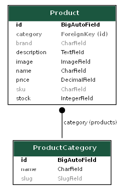

### Orders App
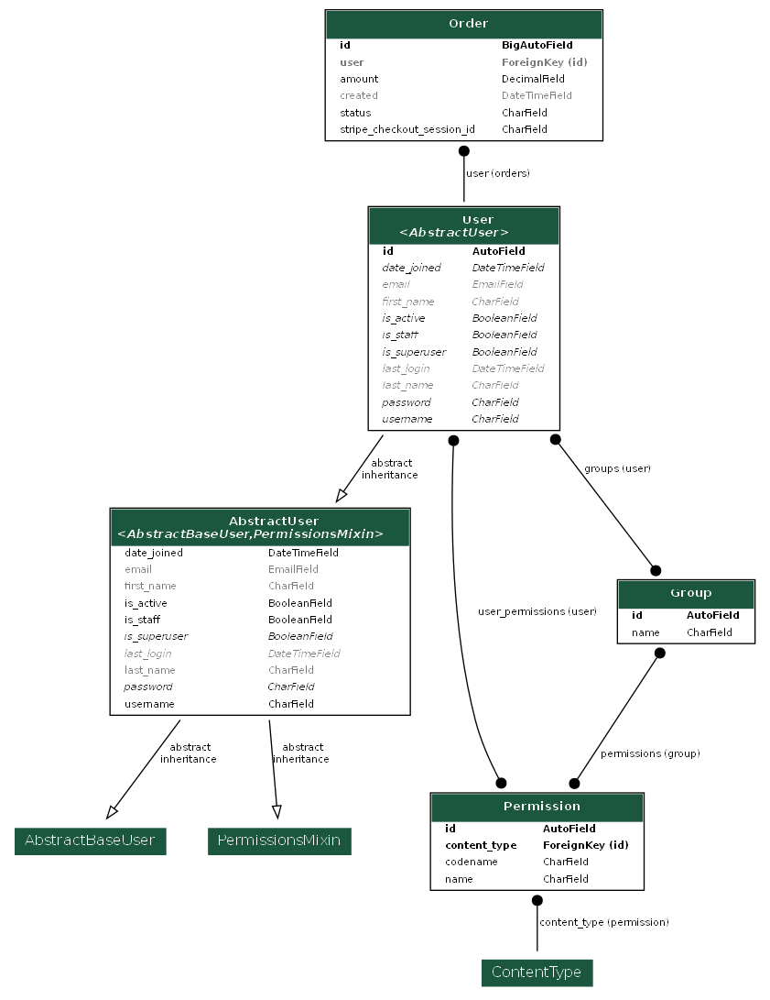

### Training App
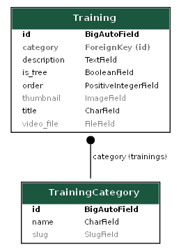


---

## Data Validation

In the Pawsitive Training project, data validation is handled on the client side using JavaScript to ensure smooth and secure interactions between the user interface and the server. Key aspects include:

- **Input and Response Verification:**  
  The JavaScript files validate data both before sending it to the server (e.g., ensuring necessary headers like CSRF tokens are included) and after receiving a response. This helps catch issues such as malformed requests or unexpected responses.

- **Error Handling and User Feedback:**  
  The code uses robust error handling with console logging and visual notifications (via toastr) to inform users when actions like adding to or removing from the basket fail, or if a Stripe checkout process encounters an error.

- **Ensuring Consistent UI Updates:**  
  The scripts check the data returned from server calls (such as updated basket totals or subscription statuses) before updating the UI. This prevents the display of incorrect or incomplete information.

- **Securing Data Transactions:**  
  By including CSRF tokens in AJAX requests and verifying that the expected JSON responses are received, the project safeguards data integrity during user transactions.

Together, these measures ensure that data flowing between the front-end and back-end is validated, errors are caught and communicated effectively, and the user experience remains reliable and secure.

---
---

# Testing
- Manual testing
- Validator testing
- User story testing
- Automated testing

---

## Manual Testing

### Feature Testing
Manual testing of the site's features was carried out on a 1920 x 1080 desktop screen, a Samsung tablet, and an iPhone 12 Pro to ensure optimal functionality across devices.

# Comprehensive Manual Testing Checklist for Pawsitive Training Project

Below is a detailed checklist covering the main pages and functionalities of the project.

---

<details>
<summary>General Template & Page Structure</summary>

| Page / Template       | Feature                                   | Action                                                                     | Effect                                                                           |
|-----------------------|-------------------------------------------|----------------------------------------------------------------------------|----------------------------------------------------------------------------------|
| Base Template         | Meta Tags & SEO                           | View page source and inspect meta, Open Graph, and JSON-LD tags              | All meta tags, Open Graph data, and structured data are correctly embedded       |
| Base Template         | CSS & JavaScript Loads                    | Load the page and check the browser console for errors                       | All external CSS/JS files load without errors                                    |
| Base Template         | Responsive Layout                         | Resize the browser window (desktop/tablet/mobile)                            | Layout adjusts correctly for various screen sizes                                |
</details>

<details>
<summary>Navigation & Header</summary>

| Page / Template       | Feature                                   | Action                                                                     | Effect                                                                           |
|-----------------------|-------------------------------------------|----------------------------------------------------------------------------|----------------------------------------------------------------------------------|
| Base Template (Header)| Logo & Branding                           | Click the logo                                                             | Redirects to the Welcome (home) page                                             |
| Base Template (Header)| Search Form Action                        | Select a search category, enter a query, and submit                        | Navigates to the correct search results page (Products or Training)              |
| Base Template (Header)| Account Dropdown                          | Open the dropdown as an unauthenticated and then as an authenticated user    | Shows Register/Login for guests; My Profile/Logout (and Product Management for staff) when logged in  |
| Base Template (Header)| Basket Link Display                       | Verify the basket total displayed                                          | Correct basket total (e.g., "$0.00" if empty or updated value) is shown           |
</details>

<details>
<summary>Welcome (Home) Page</summary>

| Page               | Feature                                       | Action                                                   | Effect                                                                   |
|--------------------|-----------------------------------------------|----------------------------------------------------------|--------------------------------------------------------------------------|
| Welcome Page       | Call-to-Action Buttons                        | Click "Shop Here" and "Train Here" buttons               | "Shop Here" redirects to Products page; "Train Here" redirects to Training page  |
| Welcome Page       | Newsletter Signup                             | Enter a valid email and submit the form                  | A success (or error) message is displayed via Toastr                       |
</details>

<details>
<summary>Lessons Listing Page</summary>

| Page                        | Feature                                          | Action                                                                     | Effect                                                                           |
|-----------------------------|--------------------------------------------------|----------------------------------------------------------------------------|----------------------------------------------------------------------------------|
| Lessons Listing Page        | Training Cards Display                           | Inspect each training card on the grid                                     | Each card shows a thumbnail (or placeholder), title, truncated description, and a "Watch Lesson" button |
| Lessons Listing Page        | Locked Overlay for Non-Subscribers               | For non-free lessons, verify the overlay is visible when user is not subscribed | A lock icon with "Locked" text appears over the card                            |
| Lessons Listing Page        | Pagination Controls                              | Click "Previous", "Next", or a specific page number                        | Navigates correctly between pages of training cards                              |
</details>

<details>
<summary>Training Detail Page</summary>

| Page                        | Feature                                          | Action                                                                     | Effect                                                                           |
|-----------------------------|--------------------------------------------------|----------------------------------------------------------------------------|----------------------------------------------------------------------------------|
| Training Detail Page        | Video Player & Content Display                   | Play the video and check the poster image                                  | The video plays with functional controls and the poster image displays before playback |
| Training Detail Page        | Navigation Back to Lessons                       | Click the "Back to Lessons" button                                         | Returns to the Lessons Listing Page                                              |
</details>

<details>
<summary>Search Results Page (Training Lessons Search)</summary>

| Page                        | Feature                                          | Action                                                                     | Effect                                                                           |
|-----------------------------|--------------------------------------------------|----------------------------------------------------------------------------|----------------------------------------------------------------------------------|
| Search Results Page         | Results Header                                   | Perform a search and inspect the header                                    | Header displays "Search Results for 'search term'" (or appropriate text)           |
| Search Results Page         | Training Card Display                            | Verify each search result card shows a thumbnail, title, and description     | Cards render correctly with all required details                                 |
| Search Results Page         | Pagination Controls                              | Click pagination controls (Previous/Next)                                  | Navigates through search result pages accurately                                 |
</details>

<details>
<summary>Additional Functionality & UI Elements</summary>

| Page / Template       | Feature                                   | Action                                                                     | Effect                                                                           |
|-----------------------|-------------------------------------------|----------------------------------------------------------------------------|----------------------------------------------------------------------------------|
| All Pages             | Toastr Notifications                      | Trigger actions (e.g., newsletter signup, add to basket)                   | Toast messages appear with correct styling (close button, progress bar, timeout)   |
| Basket & Related Pages| Dynamic UI Updates                        | Add or remove items from the basket via AJAX                               | Basket totals, quantities, and prices update without full page reload            |
| All Pages             | Accessibility & Alt Text                  | Inspect images and interactive elements for alt text and keyboard access   | All images have meaningful alt text; interactive elements are keyboard accessible |
</details>

<details>
<summary>Basket App</summary>

| Page                      | Feature                                              | Action                                                         | Effect                                                                 |
|---------------------------|------------------------------------------------------|----------------------------------------------------------------|------------------------------------------------------------------------|
| /basket/view_basket/      | All items appear in list                             | Add an item to the basket from the product detail page         | The added item appears in the basket table                           |
| /basket/view_basket/      | Correct item quantities                             | Add multiple items from the product detail page                | The correct number of items appears in the basket                      |
| /basket/view_basket/      | Increment button increases quantity                 | Click the increment button                                     | Quantity increases by 1                                                |
| /basket/view_basket/      | Decrement button decreases quantity                 | Click the decrement button                                     | Quantity decreases by 1                                                |
| /basket/view_basket/      | Minimum quantity enforced                            | Decrement quantity down to 1                                   | The decrement button becomes inactive at 1                           |
| /basket/view_basket/      | Maximum quantity enforced                            | Increment quantity up to 10                                    | The increment button becomes inactive at 10                          |
| /basket/view_basket/      | Smooth quantity changes without immediate reload     | Click increment and decrement buttons quickly                  | Buttons work responsively, with a brief delay before the page reloads   |
| /basket/view_basket/      | Confirmation message after quantity change           | Change quantity and wait a moment                              | Page reloads with a confirmation message showing the updated quantity  |
| /basket/view_basket/      | Removal of items from basket                         | Click the trash icon on an item                                | The item is removed from the basket                                  |
| /basket/view_basket/      | Display message when basket is empty                 | Navigate to the basket page without any items                  | A message indicates that the basket is empty                           |
| /basket/view_basket/      | Navigation back to shop                              | Click the shop link                                            | User is redirected to the products page                                |
| /basket/view_basket/      | Clear basket functionality                           | Click the 'clear all' link                                     | The basket is emptied and the user is redirected to the products page  |
| /basket/view_basket/      | Correct subtotal calculation                         | Add two products to the basket                                 | The subtotal equals the sum of the product prices                      |
| /basket/view_basket/      | Consistent product pricing                           | Compare product price on product detail with that in the basket   | Prices match across pages                                              |
| /basket/view_basket/      | Checkout button functionality                        | Click the checkout button                                      | User is redirected to the Checkout page                                |
| /basket/view_basket/      | Direct input validation                              | Try entering an out-of-range quantity manually                   | The input value is automatically corrected to fall within the allowed range |
</details>

<details>
<summary>Checkout & Payment Pages</summary>

| Page / Endpoint                          | Feature                                                     | Action                                                                                          | Effect                                                                                         |
|------------------------------------------|-------------------------------------------------------------|-------------------------------------------------------------------------------------------------|------------------------------------------------------------------------------------------------|
| /payments/checkout/                      | Checkout page displays basket items                         | Navigate to the Checkout page after adding products to the basket                              | Basket items, their quantities, individual totals, and overall basket total are displayed     |
| /payments/checkout/                      | Stripe publishable key in context                           | Inspect page source or console                                                                 | The Stripe publishable key is present in the page context                                      |
| API: create_checkout_session             | Create Checkout Session endpoint                            | Trigger a POST request (via button click or API tool) with CSRF token and basket data            | Returns a JSON response with a session id and a message indicating redirection to Stripe        |
| /payments/payment-success/               | Payment success page                                        | Simulate a successful payment and navigate to the success URL                                  | A success message is displayed; product stock is updated and the basket is cleared              |
| /payments/payment-cancel/                | Payment cancel page                                         | Simulate cancelling a payment and navigate to the cancel URL                                   | An error message is displayed, indicating the payment was cancelled                             |
</details>

<details>
<summary>Stock Management Pages (Staff Only)</summary>

| Page                                  | Feature                                                | Action                                                                                          | Effect                                                                                        |
|---------------------------------------|--------------------------------------------------------|-------------------------------------------------------------------------------------------------|-----------------------------------------------------------------------------------------------|
| /products/update_stock/<product_id>/  | Update Stock Form                                      | As a staff member, navigate to a product's update stock page and submit a valid stock update    | The product's stock level is updated; a success message is shown and the user is redirected      |
| /products/update_stock/<product_id>/  | Form Validation                                        | Submit the update form with invalid data                                                       | An error message is displayed prompting correction                                             |
| /products/stock_list/                  | Stock List Display                                     | Navigate to the Stock List page as a staff member                                               | A list of all products with their current stock levels is displayed                             |
</details>

<details>
<summary>Products & Search Pages</summary>

| Page                                       | Feature                                                     | Action                                                                                          | Effect                                                                                         |
|--------------------------------------------|-------------------------------------------------------------|-------------------------------------------------------------------------------------------------|------------------------------------------------------------------------------------------------|
| /products/products_display/                | Products Display Page (All Products)                        | Navigate to the products display page                                                           | A paginated list of all products is displayed                                                  |
| /products/category_products/<category_slug>/ | Category Products Page                                     | Navigate to a category-specific page from a category link                                       | Only products belonging to the selected category are displayed; pagination works correctly     |
| /products/search/                          | Product Search                                             | Enter a valid search term and submit the search form                                           | Products matching the search query (by name and description) are displayed with pagination       |
| /products/products_detail/<pk>/            | Product Detail Page                                        | Click on a product from any list to view its details                                            | The product detail page shows comprehensive information about the product (name, price, etc.)    |
</details>

---

[Return to top](#pawsitive_training)
### Responsiveness

All pages on the live site were tested using the default device presets in Chrome DevTools—covering desktop, tablet, and mobile views. Public-facing pages (such as the Welcome, Product Display, Product Detail, Basket, and Checkout pages) have been optimized for both portrait and landscape orientations to ensure a seamless user experience across all devices.

For staff-related sections (like the Product List and Order Detail pages, which are accessed via Django Admin), these pages display a large amount of tabular data. They are best viewed in landscape mode on smaller devices. A note is displayed on these pages when accessed from small screens in portrait mode to inform users of this limitation. While non-essential columns are hidden on medium-sized screens to improve readability, a minimum set of columns remains visible to ensure the pages remain functional. Given that these pages are intended for staff use rather than end consumers, this compromise is acceptable.

### Lighthouse


<details>
<summary>Lighthouse results by page</summary>

### Welcome Page
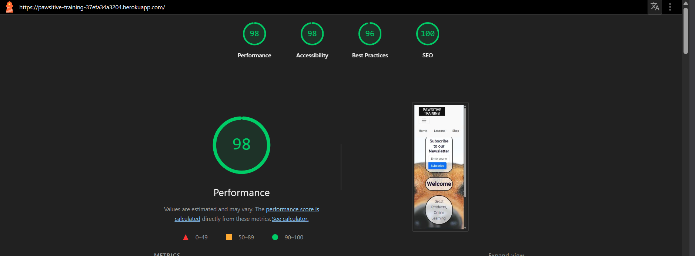

### Product Display Page
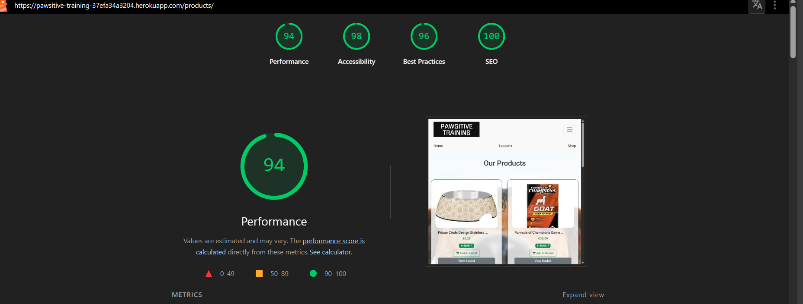

### Product Detail Page
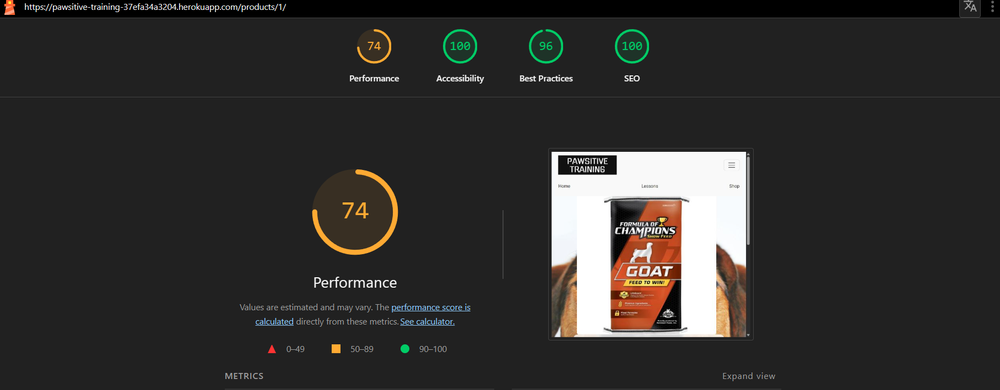

### Basket Page
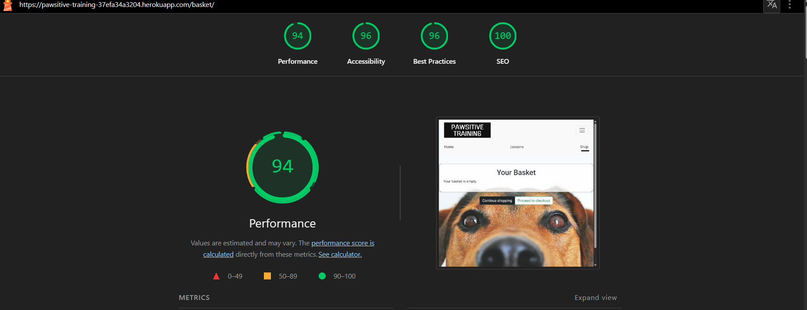

### Checkout Page
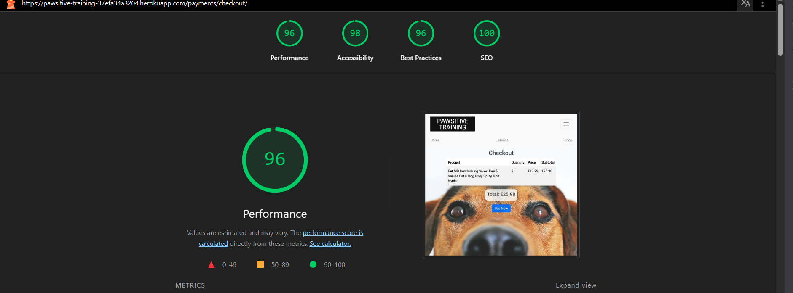

### Payment Success Page
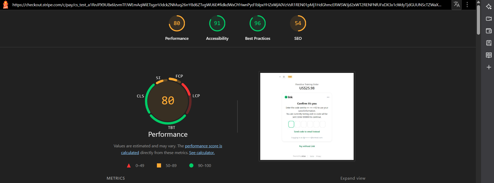

### Video Lessons Page
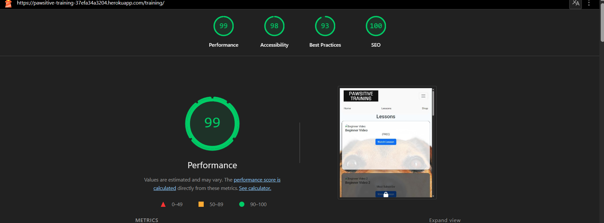

### Video Player Page
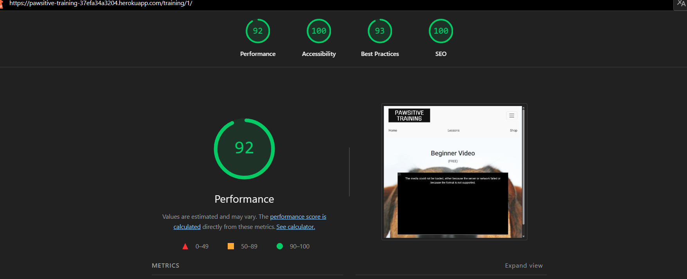

### Subscription Page
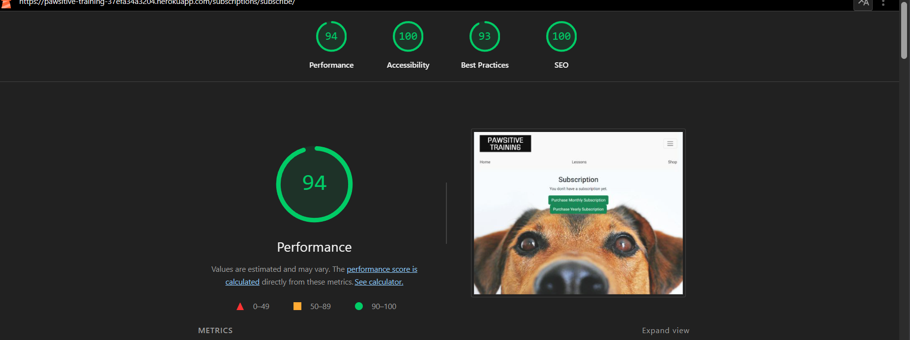

### Product Management Page
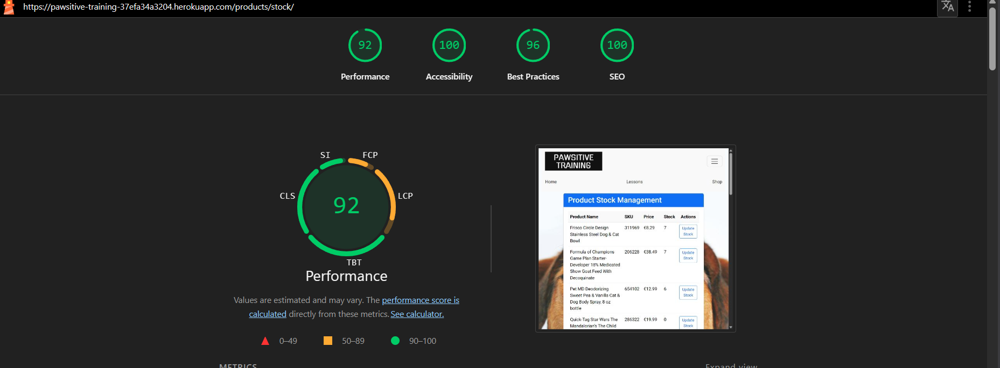

### User Profile Page
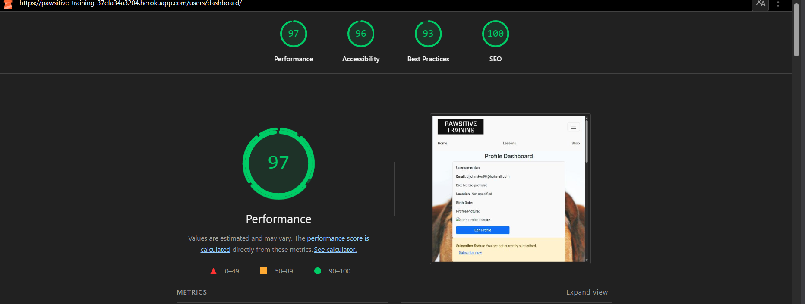

### Login Page
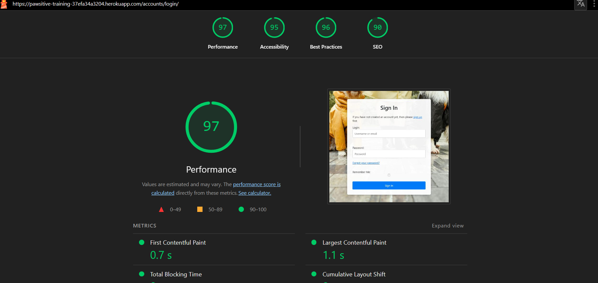

### Register Page
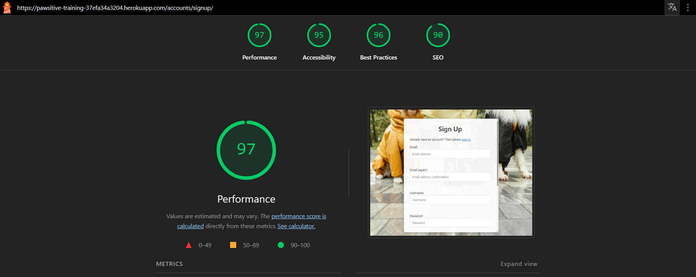

</details>

---

### Code Validation

#### Python code : 

#### JavaScript code :

#### HTML Validation :

HTML validation was performed using the **W3C Markup Validator** on the live site.

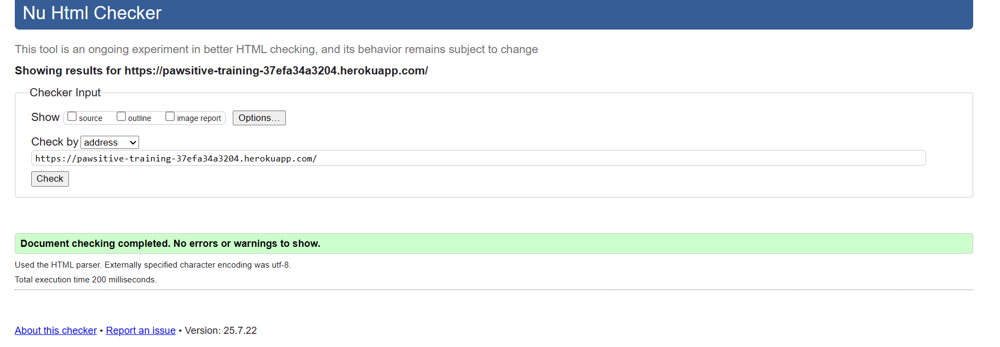

**Results Summary:** ✅ **Perfect - No errors or warnings found**

**Validation Outcome:**
- ✅ **"Document checking completed. No errors or warnings to show."**
- ✅ All HTML validation issues have been successfully resolved
- ✅ Full W3C HTML5 compliance achieved
- ✅ Clean, semantic markup throughout the application

**Issues Previously Fixed:**
1. **✅ RESOLVED: Trailing slash on void elements** 
   - Removed trailing slashes from `<link>` and `<meta>` tags across templates
   - Files updated: `base.html`, `training_detail.html`, `login_redirect.html`

2. **✅ RESOLVED: Duplicate title element** 
   - Removed duplicate title element from `base.html`
   - Each page now has exactly one properly positioned title element

**Current Status:**
- ✅ Zero HTML validation errors
- ✅ Zero HTML validation warnings  
- ✅ Full W3C HTML5 compliance
- ✅ Professional, accessible markup
- ✅ All pages render correctly across browsers

#### CSS Validation :

CSS validation was performed using the **W3C CSS Validator**.

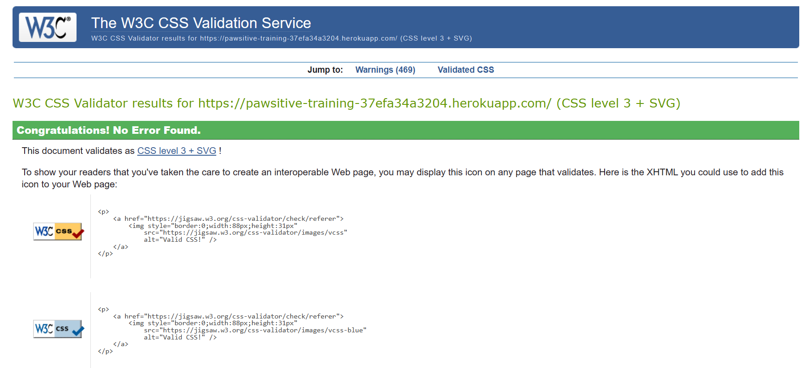

**Results Summary:** ✅ **All CSS files passed validation with no errors**

**Files validated:**
- `static/css/base.css` - ✅ No issues found
- `static/css/basket.css` - ✅ No issues found  
- `static/css/allauth.css` - ✅ No issues found

**Assessment:**
- All stylesheets follow W3C CSS3 standards
- No syntax errors or invalid properties found
- Modern CSS3 features used appropriately
- Responsive design principles implemented correctly
- Clean, maintainable CSS structure throughout

---
## Stripe Webhook Testing


### Stripe Payment Flow

For a more robust payment process, the application is designed to record orders and subscriptions in the database *before* initiating the Stripe payment process. A `payment_confirmed` flag is set to false by default when an order is created. This ensures that every purchase—whether for pet training products or training video subscriptions—is recorded before any network communication with Stripe begins.

The order's unique identifier is sent to Stripe as metadata, which allows the order to be accurately retrieved later without having to reconstruct it from the basket contents. When the Stripe payment process completes successfully (via the confirmPayment method called in `stripe_payments.js`), the front-end sends a POST request back to the server to update the corresponding order, setting the `payment_confirmed` flag to true.

If the payment process fails or the POST request encounters an error, the Stripe webhook event (`stripe.payment_intent.succeeded`) is used as a fallback. The webhook handler checks for the corresponding order in the database and, if found, ensures the `payment_confirmed` flag is updated. If no matching order is found, the handler can reconstruct the order using the basket information included in the metadata, serving as an insurance policy.

This approach offers the added advantage that any orders whose payments are not processed remain in the system, allowing staff and users to review or follow up on these transactions later (although this follow-up functionality is not implemented in the current version of the project).

### Webhook Tests

The pawsitive_training project listens for several key Stripe webhook events to ensure that all payment transactions—both for product orders and training lesson subscriptions—are accurately recorded. Our payment flow is designed to create orders in the database before the Stripe payment process begins, with a `payment_confirmed` flag set to false. Essential metadata (such as an order number) is sent to Stripe so that, upon successful payment, the webhook events can update the corresponding record in our database. Manual tests were conducted by forwarding webhook events to a local listener on port 8000. (Note: the webhook for the deployed Heroku app was temporarily disabled during testing since both environments share the same database.)

- **stripe.payment_intent.succeeded:**  
  The webhook handler retrieves the order number from the event metadata and confirms that the corresponding order exists. If it does, the handler updates the order record, setting `payment_confirmed` to true. This was tested by temporarily disabling the view that normally sets this flag, then verifying via the admin panel that after a successful payment, the order's `payment_confirmed` flag was correctly updated.

- **stripe.payment_intent.payment_failed:**  
  This handler simply acknowledges the event by returning an HTTP 200 response to Stripe, confirming receipt of the event even though no changes are made to the order.

- **stripe.checkout.session.completed:**  
  This webhook is critical for our subscription service. When a user subscribes to access full-length pet training video lessons, the handler checks the corresponding subscription record (e.g., in a UserOrderProfile or similar model) and ensures that the `subscriber` flag is set to true. It also verifies that `stripe_customer_id` and `stripe_subscription_id` are populated correctly based on the metadata. Tests confirmed that when webhook forwarding is enabled, these fields are updated as expected after a successful subscription payment.

- **stripe.invoice_paid:**  
  This event triggers the handler to update the subscription status for a user. Upon receiving this event, the handler sets the `subscription_paid` flag to true, activating full access to premium training video content. Tests confirmed that the flag was correctly updated in the database when this webhook was received.

- **stripe.invoice.payment_failed:**  
  In the event that an invoice payment fails, the handler updates the subscription record by setting the `subscription_paid` flag to false, thereby revoking access to premium content. Although this webhook is more challenging to test (requiring a test card with a short expiration date), initial tests in Stripe's test environment indicate that the handler behaves as expected.

Through these webhook handlers, the pawsitive_training project ensures that any changes in payment status reported by Stripe are accurately and reliably reflected in our order and subscription records.


---


## Automated Testing

### Testing django views, models and forms.


[Return to top](#pawsitive_training)

---
---

# Bugs
    
## Remaining Bugs

AWS S3 Integration for Media Files:
Lesson video thumbnails, uploaded videos, and the logo are not displaying correctly. This appears to be due to issues with AWS S3 configuration or file permissions. Further investigation is needed to verify file uploads, bucket policies, and URL generation.

Database Configuration Discrepancies:
Some inconsistencies between local and production database setups have been noted. Ensuring a consistent configuration across environments remains a priority.

Responsive Design Adjustments:
While most pages display correctly across devices, some staff administration pages and detailed views could benefit from further responsive design tweaks.

Stripe Payment Edge Cases:
Additional testing is required to handle edge cases in the payment flow, such as handling payment failures or reconciling orders that are not properly marked as paid.

Automated Test Coverage:
Although core functionalities are covered, additional tests (such as for newsletter signup and search functionality) could improve overall test coverage.


[Return to top](#pawsitive_training)

---
---

# Libraries and Programs Used

## Languages
- **Python 3.8+**: Primary programming language
- **HTML5**: Markup language for structure
- **CSS3**: Styling and responsive design
- **JavaScript**: Frontend interactivity and AJAX functionality

## Frameworks and Libraries
- **Django 4.2**: Web framework for rapid development
- **Bootstrap 5**: CSS framework for responsive design
- **jQuery**: JavaScript library for DOM manipulation
- **Stripe**: Payment processing API
- **Boto3**: AWS SDK for Python (S3 integration)

## Database
- **PostgreSQL**: Primary database (Heroku Postgres)
- **SQLite**: Local development database

## Cloud Services
- **Heroku**: Application hosting and deployment
- **AWS S3**: Static and media file storage
- **MailChimp**: Email marketing and newsletter services

## Development Tools
- **Git**: Version control
- **GitHub**: Code repository and project management
- **VS Code**: Code editor
- **Flake8**: Python code linting and style validation

---
---

# Deployment

## Using an AWS S3 Bucket for Static and Media Storage

The pawsitive_training project stores all of its static and media files—such as images (for products and training content) and any audio clips uploaded by staff—in an AWS S3 bucket. Using S3 ensures that these files are persistently stored and can be efficiently delivered to users regardless of dyno restarts or new deployments. Detailed instructions on setting up and configuring an S3 bucket can be found [here](https://aws.amazon.com/s3/?nc2=h_ql_prod_fs_s3).

On the Django side, the following configuration in your `settings.py` is necessary to integrate with S3:

python
AWS_STORAGE_BUCKET_NAME = 'daaansawsbucket'
AWS_S3_REGION_NAME = 'eu-north-1'
AWS_ACCESS_KEY_ID = os.environ.get('AWS_ACCESS_KEY_ID')
AWS_SECRET_ACCESS_KEY = os.environ.get('AWS_SECRET_ACCESS_KEY')
AWS_S3_CUSTOM_DOMAIN = f'{AWS_STORAGE_BUCKET_NAME}.s3.amazonaws.com'

# Static and Media files settings
STATICFILES_STORAGE = 'custom_storages.StaticStorage'
STATICFILES_LOCATION = 'static'
DEFAULT_FILE_STORAGE = 'custom_storages.MediaStorage'
MEDIAFILES_LOCATION = 'media'

# Override static and media URLs in production
STATIC_URL = f'https://{AWS_S3_CUSTOM_DOMAIN}/{STATICFILES_LOCATION}/'
MEDIA_URL = f'https://{AWS_S3_CUSTOM_DOMAIN}/{MEDIAFILES_LOCATION}/'


## Deploying the App on Heroku

1. **Log into Heroku:**  
   Navigate to the Heroku Dashboard and click on the **New** button.

2. **Create a New App:**  
   - Choose a unique app name (e.g., `pawsitive-app`) and select the region closest to you.

3. **Set Up a Database:**  
   - Go to the **Resources** tab.
   - Click the **Find more add-ons** button.
   - Search for and select **Heroku Postgres**; then click **Install Heroku Postgres**.
   - Choose a plan (the default Mini plan at $5.00/month is sufficient for most cases) and link it to your app.
   - Return to the **Resources** tab, click the Heroku Postgres icon, then open the **Settings** tab and click on **Database Credentials**.
   - Copy the provided URI and paste it into your `env.py` file under the key `DATABASE_URL`. This ensures you use the same database for both development and production.

4. **Configure Environment Variables:**  
   - In the **Settings** tab on the Dashboard, click **Reveal Config Vars**.
   - Your database URL should be auto-populated. Add your Django secret key and set the `PORT` variable to `8000`.

5. **Add a Procfile:**  
   - In your local repository, create a file named `Procfile` in the root directory.
   - Add the following line:
     ```
     web: gunicorn pawsitive.wsgi
     ```

6. **Update Django Settings:**  
   - Add your Heroku project URL to the `ALLOWED_HOSTS` list in your `settings.py`.

7. **Set Up Social Authentication:**  
   - Create two social apps for Facebook and Google sign-in.
   - Add the respective API keys and secrets to your database.
   - Update the application details and callback URLs on the Google and Facebook OAuth dashboards.

8. **Configure Stripe (for payments, if applicable):**  
   - Open a Stripe account and add your `STRIPE_PRIVATE_KEY` and `STRIPE_SECRET` to the Heroku config vars.
   - Set up a webhook to target your designated endpoint, and copy the `STRIPE_WEBHOOK_SECRET` to the config vars.
   - (Optional) Create three products in the Stripe Developer console to match the subscription durations offered in Pawsitive, and link their API keys to the corresponding subscription instances in the database.

9. **Prepare for Deployment:**  
   - Set `DEBUG` to `False` in your settings.
   - Commit your changes and push them to GitHub.

10. **Configure Heroku Buildpacks and Deployment:**  
    - In Heroku, navigate to the **Settings** tab and scroll to the **Buildpacks** section.
    - Click **Add Buildpack**, select the Python buildpack, and save the changes.
    - Go to the **Deploy** tab, select the GitHub icon under **Deployment Method** to connect your GitHub repository.
    - Enter your repository name (e.g., `yourusername/pawsitive`), click **Search**, and then click **Connect** when your repo appears.
    - Under **Manual deploy**, click **Deploy Branch**.  
      You should see a confirmation message such as "Your app was successfully deployed." Click **View** to open the app in your browser.


## Making a local clone

1. Open a terminal or command prompt on your local machine.
2. Navigate to the directory where you want to clone the project.
3. Enter the following command: 'git clone https://github.com/pac-dan/pawsitive.git'


## Running the app in your local environment

1. Create a virtual enviroment in the new project folder using the command `python3 -m venv venv`
2. Activate the virtual environment : `source venv/bin/activate`
3. Install the project requirements : `pip3 install -r requirements.txt`
4. Create an env.py file containing the following variables (see env.example.py in the root directory of the project for a complete list of variables necessary to run the app) :
    - AWS_ACCESS_KEY_ID : Used to access S3 bucket for static and media files
    - AWS_SECRET_ACCESS_KEY : As above
    - BASE_URL : The root URL for the dev project, usually `http://localhost:8000/`
    - DATBASE_URL : This is the url generated by Heroku - see [Deploying the app](#deploying-the-app-on-heroku)
    - DEBUG : Set to True for development work locally
    - EMAIL_APP_PASSWORD : The email password for your email account
    - EMAIL_APP_USER : A personal or ephemeral email account you can use to test your email functionality.
    - PORT : Default Django port is 8000.
    - SECRET_KEY : This is the Django secret key.
    - STRIPE_PRIVATE_KEY : Stripe private key credential
    - STRIPE_PUBLIC_KEY : Stripe public key credential
    - STRIPE_WEBHOOK_SECRET : Stripe webhook signing secret


[Return to top](#pawsitive_training)

---
---

# Credits


# Acknowledgements

- **Facebook Page**: [Pawsitive Training Facebook Page](https://www.facebook.com/profile.php?id=61574171532774) - Our social media presence for community engagement and updates.
- **Bootstrap**: For the responsive framework and UI components.
- **Django**: For the robust web framework.
- **Stripe**: For secure payment processing.
- **Heroku**: For hosting and deployment services.
- **AWS S3**: For static and media file storage.
- **MailChimp**: For newsletter integration.


[Return to top](#pawsitive_training)